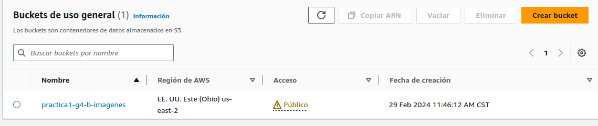
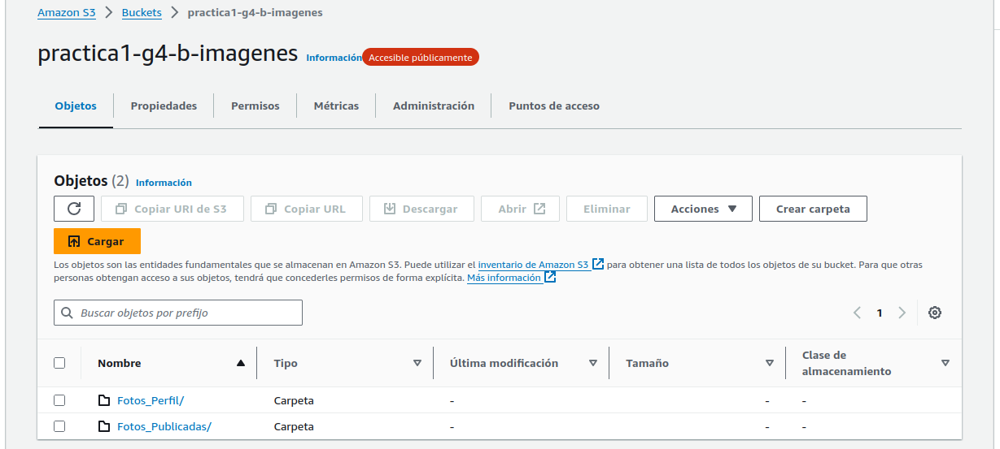
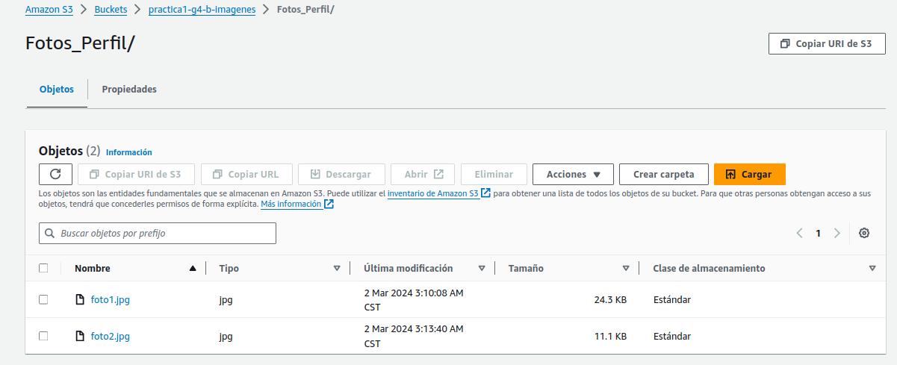
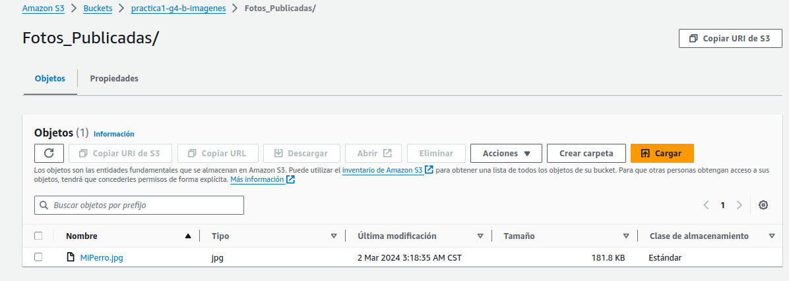
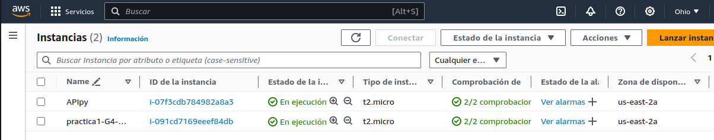
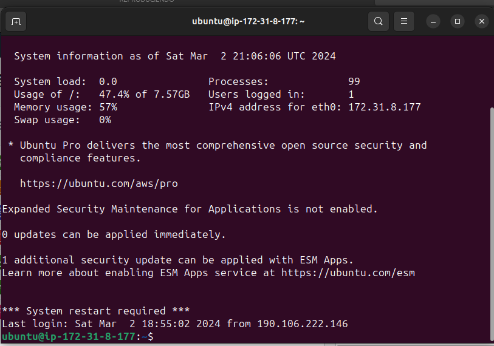

# Seminario de Sistemas 1  - Practica 1
# Grupo 4
201901055 - Angel Geovany Aragón Pérez  
201901374 - Juan Pablo González Leal  
201908355 - Danny Hugo Bryan Tejaxún Pichiyá  
____________
## Descripción de la arquitectura

## Usuarios IAM
Se crearon tres grupos distintos de usuarios con el propósito de asignar roles específicos y facilitar una gestión más eficiente

### Grupos de usuarios
#### Semi1-Practica1-EC2
En este grupo se aplicaron las políticas de seguridad de 'AmazonEC2FullAccess' , lo que les permite acceder plenamente a todas las funcionalidades de Amazon EC2. Sin embargo, estas políticas restringen el acceso a otros servicios de AWS, limitando así el uso exclusivamente a las capacidades de EC2.

Se han creado dos usuarios específicamente para este grupo, identificados como "user1_EC2" y "user2_EC2"

#### Semi1-Practica1-RDS
Los usuarios de este grupo tienen la capacidad de conectarse y realizar modificaciones en una base de datos específica. 
Se aplicaron políticas de seguridad, como 'AmazonRDSFullAccess', que les brindan acceso total a las funcionalidades de la base de datos relacional, mientras limitan el acceso a otras funciones de AWS. También se implementó la política 'IAMUserChangePassword', que permite a los usuarios cambiar sus propias contraseñas.
Se creó un usuario llamado 'User_rds1' para este propósito, otorgándole autorización para interactuar con la base de datos de manera adecuada dentro del grupo.

Se ha creado un usuario denominado 'User_rds1'.

#### Semi1-Practica1-S3
Los usuarios de este grupo tienen la capacidad de administrar buckets y su contenido, utilizándose para acceder al bucket de almacenamiento de imágenes tanto desde el backend como tambien para subir el frontend de la aplicación. Se aplicaron políticas de seguridad específicas, como 'AmazonS3FullAccess', que les otorgan acceso completo a todas las funcionalidades del servicio Amazon S3, restringiendo el acceso a otras funciones de AWS. Esto garantiza una gestión eficiente y segura del almacenamiento de objetos, cumpliendo con los requisitos de la aplicación.

Se han creado tres usuarios con los nombres 'User1_S3', 'User2_S3' y 'User3_S3'. 

## Buckets S3
Se realizo un bucket 'practica1-g4-imagenes' para el almacenamiuento de las imagenes a tulizar

Se crearon dos carpetas 'Fotos_Perfil','Fotos_Publicadas'

En la carpeta 'Fotos_Perfil' se guarda todas las fotos de perfil de todos los usuarios

En la carpeta 'Fotos_Publicadas' se guarda todas las fotos subidas de todos los usuarios

## EC2
Se crearon dos instancias ec2 para los backends

Conexion shh de la ec2 nodejs

## BASE RDS

## Aplicacion WEB

### Pagina de inicio

### Pagina Login

### Pagina registrar

### Pagina Home usuario logeado

### Pagina Editar Perfil

### Pagina ver fotos

### Pagina subir foto

### Pagina album

